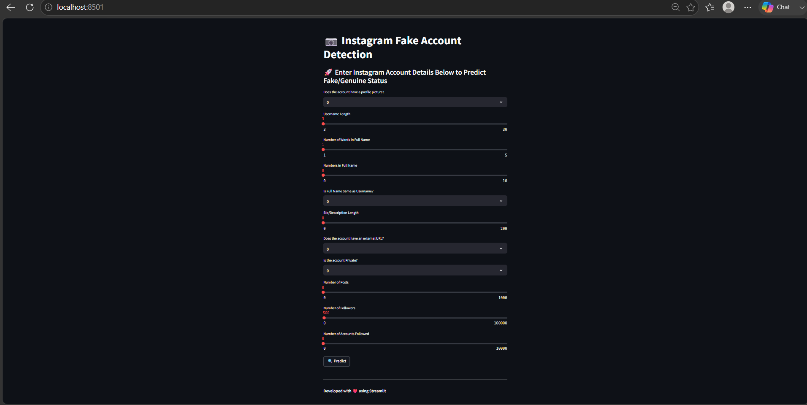

# 📷 Instagram Fake Account Detection

A Machine Learning-based application that identifies whether an Instagram account is genuine or fake using profile-level features such as follower count, following count, profile information, engagement indicators, and account characteristics.

The project uses a Random Forest Classifier trained on Instagram profile data and is deployed using Streamlit for real-time predictions.

---

## 📌 Overview

Fake Instagram accounts are commonly used for spam, scams, misinformation, and fraudulent activities. Manually identifying fake profiles can be challenging due to the large number of users on social media platforms.

This project leverages Machine Learning to automatically classify Instagram accounts as genuine or fake based on account attributes and behavioral patterns.

The trained model is integrated into a Streamlit application that enables users to enter profile information and receive instant predictions.

---

## 🚀 Features

* Detect fake Instagram accounts
* Interactive Streamlit web application
* Random Forest-based classification model
* Real-time predictions
* Feature engineering using profile metrics
* Data visualization and analysis
* Power BI reporting support

---

## 📊 Dataset

The project uses an Instagram profile dataset containing both genuine and fake accounts.

### Features Used

* Profile Picture Availability
* Username Length
* Full Name Word Count
* Numbers in Full Name
* Name Equals Username
* Description Length
* External URL Presence
* Private Account Status
* Number of Posts
* Number of Followers
* Number of Following Accounts
* Follower-Following Ratio

### Target Variable

* Fake Account (0 = Genuine, 1 = Fake)

---

## 🛠️ Technology Stack

### Programming Language

* Python

### Data Analysis

* Pandas
* NumPy

### Data Visualization

* Matplotlib
* Seaborn

### Machine Learning

* Scikit-learn
* Random Forest Classifier

### Deployment

* Streamlit

### Reporting

* Power BI

### Model Storage

* Joblib

---

## ⚙️ Project Workflow

1. Load training and testing datasets
2. Perform exploratory data analysis
3. Handle missing values and duplicates
4. Detect and cap outliers
5. Engineer new features
6. Scale numerical features
7. Train Random Forest model
8. Evaluate model performance
9. Generate predictions
10. Deploy using Streamlit

---

## 📈 Exploratory Data Analysis

The following analyses were performed:

* Missing Value Analysis
* Duplicate Record Detection
* Outlier Detection
* Feature Correlation Analysis
* Fake vs Genuine Account Distribution
* Profile Picture Analysis
* Post Count Analysis
* Private vs Public Account Analysis
* Follower-Following Ratio Analysis

---

## 🔧 Feature Engineering

A custom feature was created:

### Follower-Following Ratio

```text
(#followers + 1) / (#follows + 1)
```

This feature helps identify suspicious account behavior often associated with fake profiles.

Additional preprocessing included:

* Binary feature conversion
* Outlier capping
* Feature scaling
* Data normalization

---

## 🤖 Machine Learning Model

### Algorithm

Random Forest Classifier

### Why Random Forest?

* Handles complex feature interactions
* Robust to noisy data
* Reduces overfitting
* Provides strong classification performance

---

## 📂 Project Structure

```text
instagram-fake-id-detection/
│
├── data/
│   ├── train.csv
│   └── test.csv
│
├── model/
│   └── fake_account_detector.pkl
│
├── images/
│   ├── home_page.png
│   └── prediction_result.png
│
├── reports/
│   └── instagram-fake-spammer-detection.pdf
│
├── app.py
├── requirements.txt
├── final_test_predictions.csv
└── README.md
```

## ▶️ Installation

### Clone Repository

```bash
git clone https://github.com/Asvithak07/instagram-fake-id-detection.git
cd instagram-fake-id-detection
```

### Install Dependencies

```bash
pip install -r requirements.txt
```

### Run Application

```bash
streamlit run app.py
```

---

## 📸 Application Screenshots

### Home Page



### Prediction Result


---

## 📊 Power BI Dashboard

The project also includes Power BI reporting for exploratory data analysis and visualization of fake versus genuine account characteristics.

---

## 🎯 Real-World Applications

* Social Media Monitoring
* Spam Account Detection
* Fraud Prevention
* Digital Trust & Safety
* Influencer Verification
* Social Platform Security

---

## 🚀 Future Improvements

* Deep Learning-based classification
* Profile image analysis using CNNs
* Real-time API deployment
* Explainable AI integration
* Enhanced dashboard analytics
* Multi-platform fake account detection

---

## 👩‍💻 Author

**Asvithaa K**

Machine Learning & Data Science Enthusiast

---

## ⭐ Support

If you found this project useful, consider giving it a star on GitHub.
